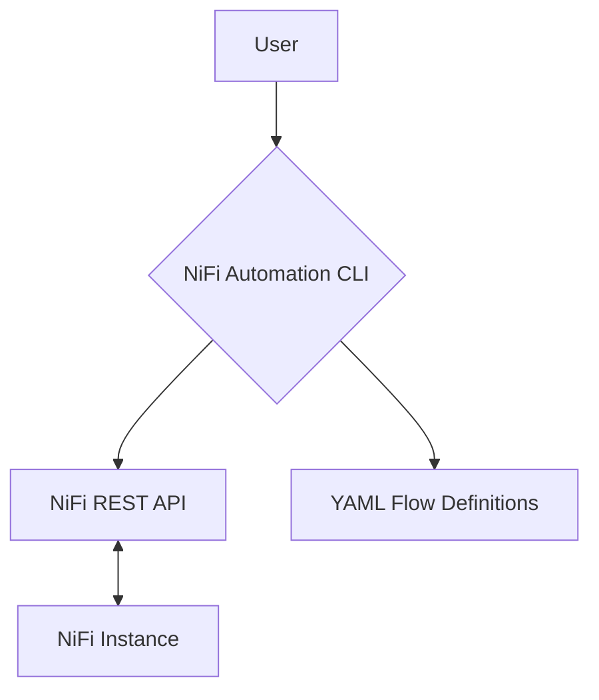

# NiFi Automation Architecture

This document provides a high-level overview of the architecture of the NiFi Automation project.

## High-Level Architecture

This diagram shows the main components of the system and how they interact.



**Components:**

-   **User:** The user interacts with the system through the NiFi Automation CLI.
-   **NiFi Automation CLI:** The command-line interface for managing NiFi flows.
-   **NiFi REST API:** The REST API for interacting with a NiFi instance.
-   **NiFi Instance:** A running instance of Apache NiFi.
-   **YAML Flow Definitions:** Declarative files that define the structure and configuration of NiFi flows.

---

## CLI Internal Architecture

This diagram provides a more detailed view of the internal components of the CLI.

```mermaid
graph TD
    A[CLI (Typer)] --> B{Commands};
    B --> C[auth.py];
    B --> D[client.py];
    B --> E[flow_builder.py];
    D --> F[httpx Client];
    F --> G[NiFi REST API];
    C --> G;
    E --> D;
    H[config.py] --> C;
    H --> D;
    I[YAML Flow Definitions] --> E;
```

**Components:**

-   **CLI (Typer):** The main entry point for the CLI, built with `Typer`.
-   **Commands:** The individual CLI commands (e.g., `deploy`, `status`, `purge`).
-   **`auth.py`:** Handles authentication with the NiFi REST API.
-   **`client.py`:** A thin HTTP client for making requests to the NiFi REST API.
-   **`flow_builder.py`:** Parses YAML flow definitions and deploys them to NiFi.
-   **`httpx` Client:** The underlying HTTP client used to make requests to the NiFi REST API.
-   **`config.py`:** Manages configuration using `pydantic-settings`.
-   **YAML Flow Definitions:** Declarative files that define the structure and configuration of NiFi flows.
