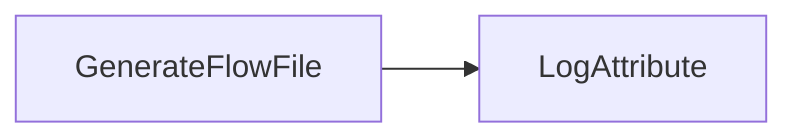
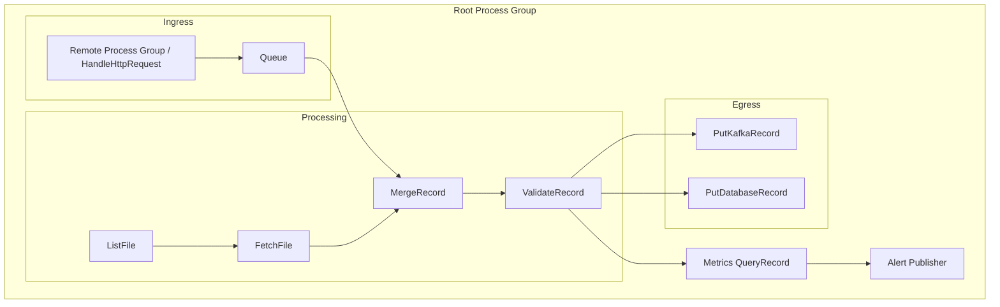

# Group One

Core and simple flows

## 1. Trivial Workflow
```nifidesc
name: TrivialFlow
Overview: Minimal smoke-test flow that generates FlowFiles and logs attributes.
Technical: A single GenerateFlowFile feeds a LogAttribute sink over the success relationship. The
sink is auto-terminated. Intended to validate deploy/start/stop plumbing without controller services.
```
- **Purpose:** Smoke-test connectivity and REST/CLI call sequencing with the smallest possible footprint.
- **Components:**
  1. `GenerateFlowFile` processor (default text payload, 0-second run schedule for continuous generation).
  2. `LogAttribute` processor to write FlowFile attributes/content to NiFi logs.
- **Connections:** One queue from `GenerateFlowFile` success to `LogAttribute` success.
- **Configuration Notes:**
  - Accept all default processor properties.
  - Use process-group scheduling defaults; no controller services or parameter contexts.
- **Validation Targets:** Processor creation, connection wiring, start/stop operations, basic provenance events.




## 2. Simple Workflow
```nifidesc
name: SimpleWorkflow
Overview: Record-based pipeline that normalizes a field and branches on a SQL predicate.
Technical: GenerateRecord (embedded Avro schema) emits fields 'status' and 'value'. UpdateRecord uppercases
/status. QueryRecord evaluates two queries: 'success' routes status='OK' and 'failure' routes all others. Logs
at both sinks. Requires JsonTreeReader and JsonRecordSetWriter controller services.
```
- **Purpose:** Introduce routing and attribute manipulation to test property configuration and back pressure basics.
- **Components:**
  1. `GenerateRecord` processor using an embedded Avro schema (generates a record with fields `status`, `value`).
  2. `UpdateRecord` to normalize fields (e.g., uppercase `status`).
  3. `QueryRecord` with two relationships—`success` and `failure`—using SQL predicates (route `status='OK'` to success, others to failure).
  4. Two `LogAttribute` processors (one per route).
- **Connections:** Linear pipeline with branching after `QueryRecord`.
- **Configuration Notes:**
  - Add a `JsonTreeReader` and `JsonRecordSetWriter` controller service pair for record processors.
  - Set back pressure threshold on the main connection (e.g., 1000 FlowFiles) to ensure queue settings propagate correctly.
- **Validation Targets:** Controller service provisioning, property JSON payloads, relationship wiring, multi-queue handling.

```mermaid
flowchart LR
    A[GenerateRecord]
    B[UpdateRecord]
    C[QueryRecord]
    D[LogAttribute (success)]
    E[LogAttribute (failure)]

    A --> B --> C
    C -->|status = 'OK'| D
    C -->|status <> 'OK'| E
```


## 3. Medium Workflow
```nifidesc
name: MediumWorkflow
Overview: Attribute-based routing with RouteOnAttribute to demonstrate branching without record processors.
Technical: GenerateFlowFile emits a FlowFile and an attribute (route=success). RouteOnAttribute defines a
'success' property using NiFi Expression Language to evaluate the attribute. Success goes to a log; unmatched
and failure go to a separate log.
```
- **Purpose:** Cover external interactions, parameter contexts, and controller dependencies.
- **Components:**
  1. `GenerateFlowFile` to create JSON payloads referencing a REST endpoint path parameter.
  2. `ReplaceText` (or `JoltTransformJSON`) to customize payload based on parameters.
  3. `InvokeHTTP` to call a mock HTTP service (use NiFi’s own `HandleHttpRequest/Response` pair within the same flow or an external test endpoint).
  4. `PutFile` to persist responses on disk.
  5. `LogAttribute` for failure relationship capture.
- **Connections:** Sequential with failure routes from `InvokeHTTP` and `PutFile` into the log.
- **Configuration Notes:**
  - Define a Parameter Context (`API_BASE_URL`, `OUTPUT_DIR`) and bind processors to it.
  - Configure SSL context service if testing secure endpoints.
  - Ensure file output path points to a writable test directory; plan cleanup as part of teardown.
- **Validation Targets:** Parameter context injection, controller service references (SSL, if applicable), external system interaction, failure handling paths.

```mermaid
flowchart LR
    A[GenerateFlowFile] --> B[Transform Payload]
    B --> C[InvokeHTTP]
    C -->|success| D[PutFile]
    C -->|failure| E[LogAttribute (HTTP failure)]
    D -->|failure| F[LogAttribute (write failure)]
```


## 4. Complex Workflow
```nifidesc
name: ComplexWorkflow
Overview: Record-generation, enrichment, and classification into high/low streams using QueryRecord.
Technical: GenerateRecord emits fields sensor, reading_value, and status. UpdateRecord normalizes status and
fills missing sensor. QueryRecord defines 'high' and 'low' queries to split by a threshold. Failure is routed
to a dedicated log. Requires JsonTreeReader and JsonRecordSetWriter controller services.
```
- **Purpose:** Exercise advanced features—nested process groups, remote connections, record processing, provenance-heavy operations.
- **High-Level Structure:**
  - **Root Process Group**
    - Sub-group `Ingress` handling Site-to-Site push (Remote Process Group ingesting from another NiFi or `HandleHttpRequest`).
    - Sub-group `Processing` performing enrichment and joins:
      - `ListFile` + `FetchFile` pair to ingest reference data.
      - `MergeRecord` to combine incoming stream with reference data via RecordReader/Writer services.
      - `ValidateRecord` enforcing schema compliance.
    - Sub-group `Egress` pushing to two destinations:
      - `PutKafkaRecord_2_0` to publish enriched data.
      - `PutDatabaseRecord` (simulate via embedded Derby/postgres docker) for persistence.
    - Monitoring components: `QueryRecord` for metrics, `PublishJMS` (mock) for alerts.
- **Configuration Notes:**
  - Multiple parameter contexts: one for environment endpoints (Kafka brokers, JDBC URL), another for file paths.
  - Requires several controller services: Avro/JSON readers/writers, DBCP connection pool, Kafka connection pool, JMS context (can use stub provider).
  - Optional `ReportingTask` (e.g., SiteToSiteStatusReportingTask) configured but disabled to confirm automation can handle additional component types.
- **Validation Targets:** Nested process groups, Remote Process Groups, Site-to-Site ports, multiple controller services, parameter inheritance, large component creation counts.
- **Test Harness Considerations:** Provide mock endpoints (dockerized Kafka/Postgres/JMS) or replace with NiFi in-process substitutes (e.g., `HandleHttpResponse`, `PutFile`) when external systems aren’t available.



