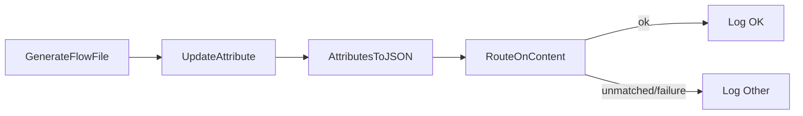
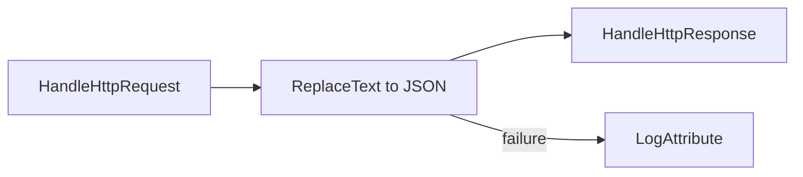

# Group Three

HTTP and composite flows

## 9. ContentAttributeRoute Workflow
```nifidesc
name: ContentAttributeRouteWorkflow
Overview: Builds minimal JSON from attributes and routes content using a regex-based RouteOnContent.
Technical: UpdateAttribute sets 'status' and 'message'; AttributesToJSON writes them into the FlowFile content
(Destination=flowfile-content). RouteOnContent exposes a dynamic 'ok' relationship matching status=OK; all
other cases go to unmatched/failure and are logged. This avoids external systems while exercising content routing.
```

```nifidesc
name: BigWorkflow
Overview: A larger, multi-stage pipeline with nested process groups, ports, and a mix of record transforms, routing, compression, and multiple HTTP ingress groups.
Technical: Parent orchestrates across two child groups (TransformGroup, ClassifierGroup) using input/output ports. Two additional HTTP echo groups run on ports 18082 and 18083.
```


## 11. TwoBranch Workflow
```nifidesc
name: TwoBranchWorkflow
Overview: Splits content and routes into two parallel branches based on fragment index parity.
Technical: GenerateFlowFile emits multi-line text; SplitText splits into single-line FlowFiles (fragment.index set).
RouteOnAttribute sends even indices to Branch A and odd indices to Branch B using Expression Language modulo tests.
Each branch logs independently. Demonstrates multi-branch fan-out.
```

```mermaid
flowchart LR
  G[GenerateFlowFile (multiline)] --> S[SplitText: 1 line]
  S -->|fragment.index % 2 == 0| A[Log A]
  S -->|fragment.index % 2 == 1| B[Log B]
```
- Purpose: Build content from attributes, then route based on content patterns without external systems.
- Components:
  1. `GenerateFlowFile` seeds an empty JSON.
  2. `UpdateAttribute` sets `status` and `message` attributes.
  3. `AttributesToJSON` writes attributes into the FlowFile content.
  4. `RouteOnContent` routes `OK` vs everything else.
  5. Two `LogAttribute` sinks.
- Validation Targets: Attribute→content transforms, regex routing, auto-termination of sinks.




## 10. HTTP Server Workflow
```nifidesc
name: HttpServerWorkflow
Overview: Exposes a minimal HTTP endpoint inside NiFi using HandleHttpRequest/HandleHttpResponse.
Technical: HandleHttpRequest listens on port 18081 and hands off a FlowFile; HandleHttpResponse returns 204 with
Content-Type header. Failure routes to a log. Demonstrates request/response correlation within a single PG without
external systems.
```




## 9. ContentAttributeRoute Workflow
```nifidesc
name: ContentAttributeRouteWorkflow
Overview: Builds minimal JSON from attributes and routes content using a regex-based RouteOnContent.
Technical: UpdateAttribute sets 'status' and 'message'; AttributesToJSON writes them into the FlowFile content
(Destination=flowfile-content). RouteOnContent exposes a dynamic 'ok' relationship matching status=OK; all
other cases go to unmatched/failure and are logged. This avoids external systems while exercising content routing.
```

```nifidesc
name: BigWorkflow
Overview: A larger, multi-stage pipeline with nested process groups, ports, and a mix of record transforms, routing, compression, and multiple HTTP ingress groups.
Technical: Parent orchestrates across two child groups (TransformGroup, ClassifierGroup) using input/output ports. Two additional HTTP echo groups run on ports 18082 and 18083.
```


