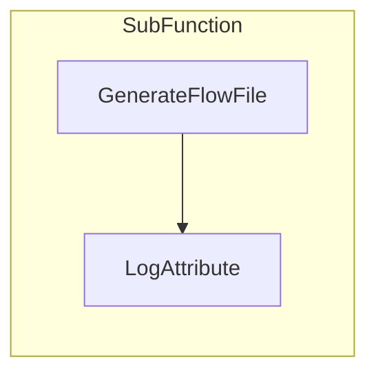
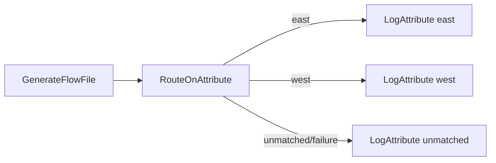
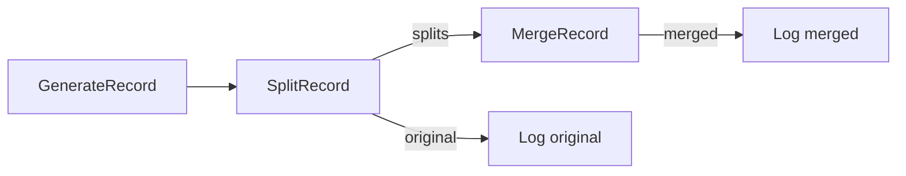

# Group Two

Branching and batching

## 5. Nested Workflow
```nifidesc
name: NestedWorkflow
Overview: Demonstrates a nested process group without ports.
Technical: Parent group contains a single child group 'SubFunction' with GenerateFlowFile feeding LogAttribute.
Tests nested creation, layout, and teardown sequencing during purge.
```
- Purpose: Validate nested process groups and local wiring without ports.
- Components: A `SubFunction` child group containing `GenerateFlowFile` → `LogAttribute`.
- Validation Targets: Child PG creation, nested component positioning, and deletion order during purge.




## 6. NestedPorts Workflow
```nifidesc
name: NestedPortsWorkflow
Overview: Demonstrates child process group ports and cross-boundary connections.
Technical: Parent GenerateFlowFile connects to the child's input port; inside the child, a LogAttribute emits
to the child's output port; the parent connects from that output port to a result logger. Validates port
creation, wiring, and layout without overlap between parent processors and child PG.
```
- Purpose: Validate input/output ports within a child process group and connections to/from the parent.
- Components: Parent `GenerateFlowFile` → Child `NestedPortsSubflow` (In Port → Log → Out Port) → Parent `LogAttribute`.
- Validation Targets: Port creation and connection wiring across PG boundaries.

```mermaid
flowchart LR
  A[GenerateFlowFile] --> IN[(Nested Sub In)]
  IN --> L[LogAttribute (Nested Sub)] --> OUT[(Nested Sub Out)]
  OUT --> R[LogAttribute (Result)]
```


## 7. PathBranch Workflow
```nifidesc
name: PathBranchWorkflow
Overview: Attribute-based branching using RouteOnAttribute with 'east' and 'west' routes plus unmatched.
Technical: Generate sets 'route' attribute; RouteOnAttribute defines properties 'east' and 'west' with NiFi
expression-language predicates; sinks are auto-terminated. Layout is router-centered with sinks stacked right.
```
- Purpose: Introduce an attribute-based path branch using `RouteOnAttribute`.
- Components:
  1. `GenerateFlowFile` sets attribute `route` (e.g., `east`).
  2. `RouteOnAttribute` with named properties (`east`, `west`) plus `unmatched`/`failure` handling.
  3. Three `LogAttribute` sinks for each path.
- Connections: `Generate` → `Route` → `Log(east|west|unmatched)`.
- Validation Targets: Multiple dynamic relationships and auto-termination on all sinks; confirms branching semantics.




## 8. SplitMerge Workflow
```nifidesc
name: SplitMergeWorkflow
Overview: Demonstrates record batch fan-out and fan-in using SplitRecord and MergeRecord.
Technical: GenerateRecord emits 9 records; SplitRecord creates 3 splits of 3 records each via the
'Records Per Split' property; MergeRecord consumes the splits and emits a single 3-record FlowFile per group
using 'Minimum/Maximum Number of Records'. Original and merged outputs are logged via dedicated sinks.
```
- Purpose: Exercise record splitting/merging behavior using existing JSON RecordReader/Writer services.
- Components:
  1. `GenerateRecord` emits a batch of records.
  2. `SplitRecord` splits into fixed-size chunks (e.g., 3 per FlowFile).
  3. `MergeRecord` reassembles chunks into a fixed-size group (3) for downstream.
  4. `LogAttribute` processors capture original and merged outputs.
- Validation Targets: Record-oriented processors, relationships (`splits`, `original`, `merged`), correct property normalization.



