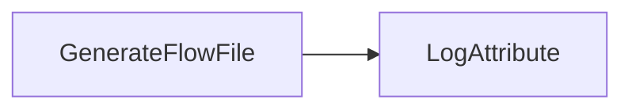
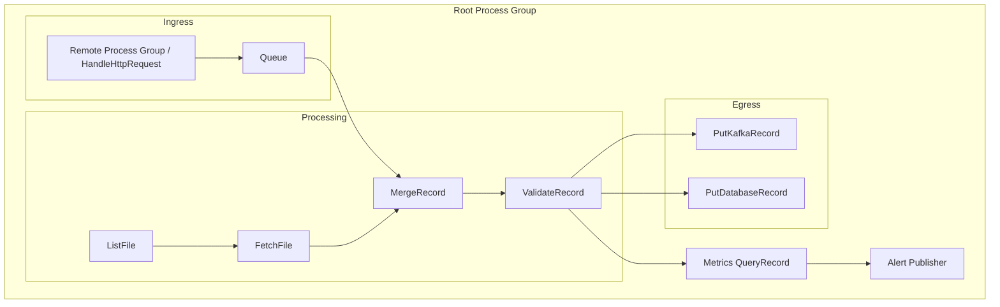
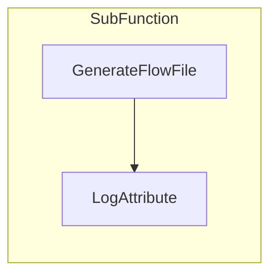
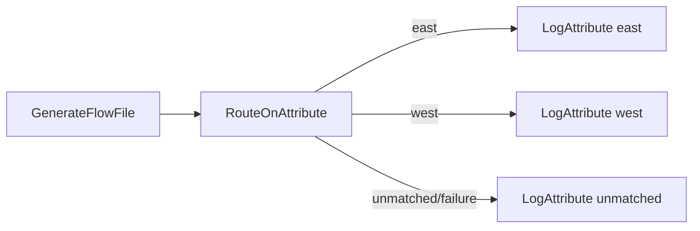
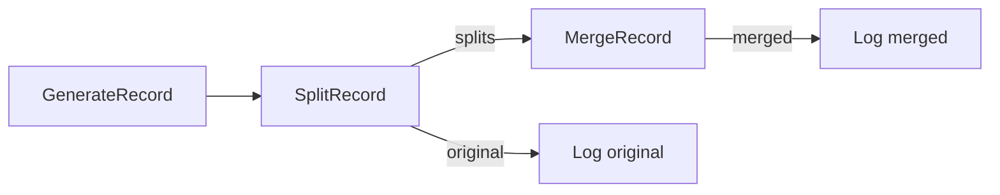
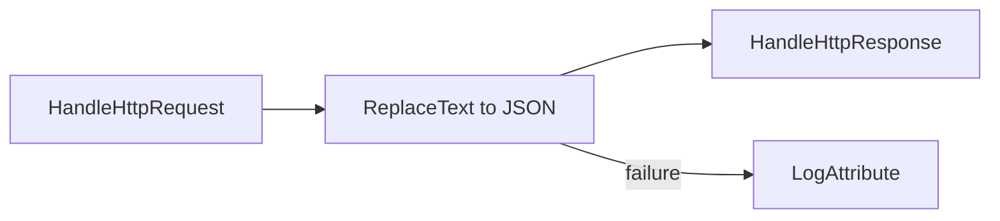
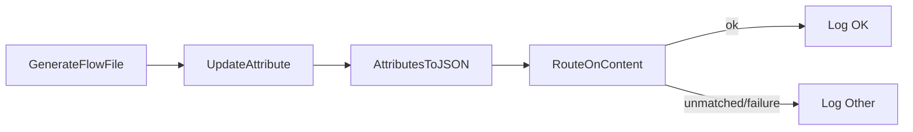

# Test Workflow Suite — LLM Notes

Programmatic automation needs predictable flow definitions to validate end-to-end deployment (create, instantiate, verify). The suite now includes multiple workflows — Trivial, Simple, Medium, Complex, Nested, NestedPorts, PathBranch, SplitMerge, and ContentAttributeRoute — providing increasing coverage of NiFi component types and configuration features while remaining deterministic enough for regression testing. All are designed to be torn down and recreated from scratch rather than incrementally updated.

Sync policy with flow specs
- The descriptions in this document must remain in lockstep with the corresponding `description` fields in the YAML specs under `automation/flows/*.yaml`.
- When you change the description in a flow’s process group in YAML, copy the text verbatim into this file (and vice‑versa) in the same PR to avoid drift.
- Keep the two-part structure in both places: “Overview” (plain English) and “Technical” (key processors, relationships, irregularities/advanced behavior). Diagrams and examples can be added here, but the core descriptive text should match exactly.

Promotion to aggregate (stress this)
- Always promote new flows to the aggregate `automation/flows/NiFi_Flow.yaml` once they deploy cleanly on their own and pass layout checks.
- Standalone specs are for iteration only; the aggregate is the canonical deployment target used by integration tests and operators.
- Include the promotion (copying the PG block into `NiFi_Flow.yaml`) in the same PR as the new flow/spec docs.

## 1. Trivial Workflow
```nifidesc
name: TrivialFlow
Overview: Minimal smoke-test flow that generates FlowFiles and logs attributes.
Technical: A single GenerateFlowFile feeds a LogAttribute sink over the success relationship. The
sink is auto-terminated. Intended to validate deploy/start/stop plumbing without controller services.
```
- **Purpose:** Smoke-test connectivity and REST/CLI call sequencing with the smallest possible footprint.
- **Components:**
  1. `GenerateFlowFile` processor (default text payload, 0-second run schedule for continuous generation).
  2. `LogAttribute` processor to write FlowFile attributes/content to NiFi logs.
- **Connections:** One queue from `GenerateFlowFile` success to `LogAttribute` success.
- **Configuration Notes:**
  - Accept all default processor properties.
  - Use process-group scheduling defaults; no controller services or parameter contexts.
- **Validation Targets:** Processor creation, connection wiring, start/stop operations, basic provenance events.



## 2. Simple Workflow
```nifidesc
name: SimpleWorkflow
Overview: Record-based pipeline that normalizes a field and branches on a SQL predicate.
Technical: GenerateRecord (embedded Avro schema) emits fields 'status' and 'value'. UpdateRecord uppercases
/status. QueryRecord evaluates two queries: 'success' routes status='OK' and 'failure' routes all others. Logs
at both sinks. Requires JsonTreeReader and JsonRecordSetWriter controller services.
```
- **Purpose:** Introduce routing and attribute manipulation to test property configuration and back pressure basics.
- **Components:**
  1. `GenerateRecord` processor using an embedded Avro schema (generates a record with fields `status`, `value`).
  2. `UpdateRecord` to normalize fields (e.g., uppercase `status`).
  3. `QueryRecord` with two relationships—`success` and `failure`—using SQL predicates (route `status='OK'` to success, others to failure).
  4. Two `LogAttribute` processors (one per route).
- **Connections:** Linear pipeline with branching after `QueryRecord`.
- **Configuration Notes:**
  - Add a `JsonTreeReader` and `JsonRecordSetWriter` controller service pair for record processors.
  - Set back pressure threshold on the main connection (e.g., 1000 FlowFiles) to ensure queue settings propagate correctly.
- **Validation Targets:** Controller service provisioning, property JSON payloads, relationship wiring, multi-queue handling.

```mermaid
flowchart LR
    A[GenerateRecord]
    B[UpdateRecord]
    C[QueryRecord]
    D[LogAttribute (success)]
    E[LogAttribute (failure)]

    A --> B --> C
    C -->|status = 'OK'| D
    C -->|status <> 'OK'| E
```

## 3. Medium Workflow
```nifidesc
name: MediumWorkflow
Overview: Attribute-based routing with RouteOnAttribute to demonstrate branching without record processors.
Technical: GenerateFlowFile emits a FlowFile and an attribute (route=success). RouteOnAttribute defines a
'success' property using NiFi Expression Language to evaluate the attribute. Success goes to a log; unmatched
and failure go to a separate log.
```
- **Purpose:** Cover external interactions, parameter contexts, and controller dependencies.
- **Components:**
  1. `GenerateFlowFile` to create JSON payloads referencing a REST endpoint path parameter.
  2. `ReplaceText` (or `JoltTransformJSON`) to customize payload based on parameters.
  3. `InvokeHTTP` to call a mock HTTP service (use NiFi’s own `HandleHttpRequest/Response` pair within the same flow or an external test endpoint).
  4. `PutFile` to persist responses on disk.
  5. `LogAttribute` for failure relationship capture.
- **Connections:** Sequential with failure routes from `InvokeHTTP` and `PutFile` into the log.
- **Configuration Notes:**
  - Define a Parameter Context (`API_BASE_URL`, `OUTPUT_DIR`) and bind processors to it.
  - Configure SSL context service if testing secure endpoints.
  - Ensure file output path points to a writable test directory; plan cleanup as part of teardown.
- **Validation Targets:** Parameter context injection, controller service references (SSL, if applicable), external system interaction, failure handling paths.

```mermaid
flowchart LR
    A[GenerateFlowFile] --> B[Transform Payload]
    B --> C[InvokeHTTP]
    C -->|success| D[PutFile]
    C -->|failure| E[LogAttribute (HTTP failure)]
    D -->|failure| F[LogAttribute (write failure)]
```

## 4. Complex Workflow
```nifidesc
name: ComplexWorkflow
Overview: Record-generation, enrichment, and classification into high/low streams using QueryRecord.
Technical: GenerateRecord emits fields sensor, reading_value, and status. UpdateRecord normalizes status and
fills missing sensor. QueryRecord defines 'high' and 'low' queries to split by a threshold. Failure is routed
to a dedicated log. Requires JsonTreeReader and JsonRecordSetWriter controller services.
```
- **Purpose:** Exercise advanced features—nested process groups, remote connections, record processing, provenance-heavy operations.
- **High-Level Structure:**
  - **Root Process Group**
    - Sub-group `Ingress` handling Site-to-Site push (Remote Process Group ingesting from another NiFi or `HandleHttpRequest`).
    - Sub-group `Processing` performing enrichment and joins:
      - `ListFile` + `FetchFile` pair to ingest reference data.
      - `MergeRecord` to combine incoming stream with reference data via RecordReader/Writer services.
      - `ValidateRecord` enforcing schema compliance.
    - Sub-group `Egress` pushing to two destinations:
      - `PutKafkaRecord_2_0` to publish enriched data.
      - `PutDatabaseRecord` (simulate via embedded Derby/postgres docker) for persistence.
    - Monitoring components: `QueryRecord` for metrics, `PublishJMS` (mock) for alerts.
- **Configuration Notes:**
  - Multiple parameter contexts: one for environment endpoints (Kafka brokers, JDBC URL), another for file paths.
  - Requires several controller services: Avro/JSON readers/writers, DBCP connection pool, Kafka connection pool, JMS context (can use stub provider).
  - Optional `ReportingTask` (e.g., SiteToSiteStatusReportingTask) configured but disabled to confirm automation can handle additional component types.
- **Validation Targets:** Nested process groups, Remote Process Groups, Site-to-Site ports, multiple controller services, parameter inheritance, large component creation counts.
- **Test Harness Considerations:** Provide mock endpoints (dockerized Kafka/Postgres/JMS) or replace with NiFi in-process substitutes (e.g., `HandleHttpResponse`, `PutFile`) when external systems aren’t available.



## 5. Nested Workflow
```nifidesc
name: NestedWorkflow
Overview: Demonstrates a nested process group without ports.
Technical: Parent group contains a single child group 'SubFunction' with GenerateFlowFile feeding LogAttribute.
Tests nested creation, layout, and teardown sequencing during purge.
```
- Purpose: Validate nested process groups and local wiring without ports.
- Components: A `SubFunction` child group containing `GenerateFlowFile` → `LogAttribute`.
- Validation Targets: Child PG creation, nested component positioning, and deletion order during purge.



## 6. NestedPorts Workflow
```nifidesc
name: NestedPortsWorkflow
Overview: Demonstrates child process group ports and cross-boundary connections.
Technical: Parent GenerateFlowFile connects to the child's input port; inside the child, a LogAttribute emits
to the child's output port; the parent connects from that output port to a result logger. Validates port
creation, wiring, and layout without overlap between parent processors and child PG.
```
- Purpose: Validate input/output ports within a child process group and connections to/from the parent.
- Components: Parent `GenerateFlowFile` → Child `NestedPortsSubflow` (In Port → Log → Out Port) → Parent `LogAttribute`.
- Validation Targets: Port creation and connection wiring across PG boundaries.

```mermaid
flowchart LR
  A[GenerateFlowFile] --> IN[(Nested Sub In)]
  IN --> L[LogAttribute (Nested Sub)] --> OUT[(Nested Sub Out)]
  OUT --> R[LogAttribute (Result)]
```

## 7. PathBranch Workflow
```nifidesc
name: PathBranchWorkflow
Overview: Attribute-based branching using RouteOnAttribute with 'east' and 'west' routes plus unmatched.
Technical: Generate sets 'route' attribute; RouteOnAttribute defines properties 'east' and 'west' with NiFi
expression-language predicates; sinks are auto-terminated. Layout is router-centered with sinks stacked right.
```
- Purpose: Introduce an attribute-based path branch using `RouteOnAttribute`.
- Components:
  1. `GenerateFlowFile` sets attribute `route` (e.g., `east`).
  2. `RouteOnAttribute` with named properties (`east`, `west`) plus `unmatched`/`failure` handling.
  3. Three `LogAttribute` sinks for each path.
- Connections: `Generate` → `Route` → `Log(east|west|unmatched)`.
- Validation Targets: Multiple dynamic relationships and auto-termination on all sinks; confirms branching semantics.



## 8. SplitMerge Workflow
```nifidesc
name: SplitMergeWorkflow
Overview: Demonstrates record batch fan-out and fan-in using SplitRecord and MergeRecord.
Technical: GenerateRecord emits 9 records; SplitRecord creates 3 splits of 3 records each via the
'Records Per Split' property; MergeRecord consumes the splits and emits a single 3-record FlowFile per group
using 'Minimum/Maximum Number of Records'. Original and merged outputs are logged via dedicated sinks.
```
- Purpose: Exercise record splitting/merging behavior using existing JSON RecordReader/Writer services.
- Components:
  1. `GenerateRecord` emits a batch of records.
  2. `SplitRecord` splits into fixed-size chunks (e.g., 3 per FlowFile).
  3. `MergeRecord` reassembles chunks into a fixed-size group (3) for downstream.
  4. `LogAttribute` processors capture original and merged outputs.
- Validation Targets: Record-oriented processors, relationships (`splits`, `original`, `merged`), correct property normalization.



## 9. ContentAttributeRoute Workflow
```nifidesc
name: ContentAttributeRouteWorkflow
Overview: Builds minimal JSON from attributes and routes content using a regex-based RouteOnContent.
Technical: UpdateAttribute sets 'status' and 'message'; AttributesToJSON writes them into the FlowFile content
(Destination=flowfile-content). RouteOnContent exposes a dynamic 'ok' relationship matching status=OK; all
other cases go to unmatched/failure and are logged. This avoids external systems while exercising content routing.
```

```nifidesc
name: BigWorkflow
Overview: A larger, multi-stage pipeline with nested process groups, ports, and a mix of record transforms, routing, compression, and multiple HTTP ingress groups.
Technical: Parent orchestrates across two child groups (TransformGroup, ClassifierGroup) using input/output ports. Two additional HTTP echo groups run on ports 18082 and 18083.
```


## 10. HTTP Server Workflow
```nifidesc
name: HttpServerWorkflow
Overview: Exposes a minimal HTTP endpoint inside NiFi using HandleHttpRequest/HandleHttpResponse.
Technical: HandleHttpRequest listens on port 18081 and hands off a FlowFile; HandleHttpResponse returns 204 with
Content-Type header. Failure routes to a log. Demonstrates request/response correlation within a single PG without
external systems.
```



## 11. TwoBranch Workflow
```nifidesc
name: TwoBranchWorkflow
Overview: Splits content and routes into two parallel branches based on fragment index parity.
Technical: GenerateFlowFile emits multi-line text; SplitText splits into single-line FlowFiles (fragment.index set).
RouteOnAttribute sends even indices to Branch A and odd indices to Branch B using Expression Language modulo tests.
Each branch logs independently. Demonstrates multi-branch fan-out.
```

```mermaid
flowchart LR
  G[GenerateFlowFile (multiline)] --> S[SplitText: 1 line]
  S -->|fragment.index % 2 == 0| A[Log A]
  S -->|fragment.index % 2 == 1| B[Log B]
```
- Purpose: Build content from attributes, then route based on content patterns without external systems.
- Components:
  1. `GenerateFlowFile` seeds an empty JSON.
  2. `UpdateAttribute` sets `status` and `message` attributes.
  3. `AttributesToJSON` writes attributes into the FlowFile content.
  4. `RouteOnContent` routes `OK` vs everything else.
  5. Two `LogAttribute` sinks.
- Validation Targets: Attribute→content transforms, regex routing, auto-termination of sinks.



## Usage Notes
- Each workflow should include a scripted teardown path: stop components, delete process group, clean up external artifacts (files, DB tables), and clear mock service state.
- Snapshot the exact component coordinates (bundle artifact/version) used for processors/controller services so programmatic tools can reference consistent components across NiFi versions.
- Keep sample schemas, parameters, and property payloads in source control alongside automation code to ensure reproducibility.
- Document the process group using the `description` field in the flow YAML. Include:
  - Overview (plain English): what the flow does.
  - Technical: key processors, relationships, and any advanced/irregular behavior (e.g., fan-out/fan-in between SplitRecord and MergeRecord).
  The deployment engine writes this text to the NiFi process group comments.
