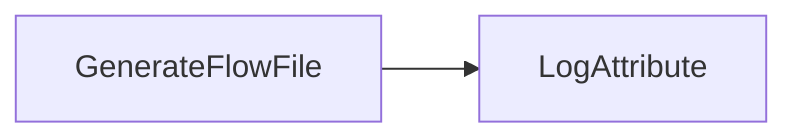
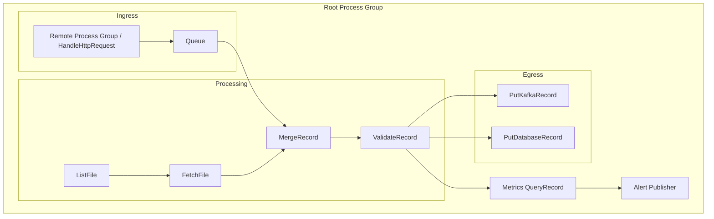
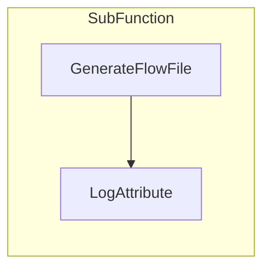
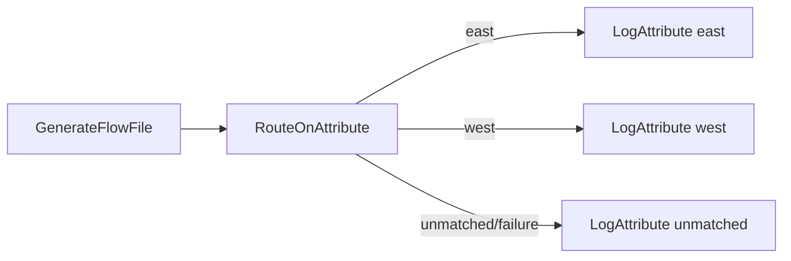
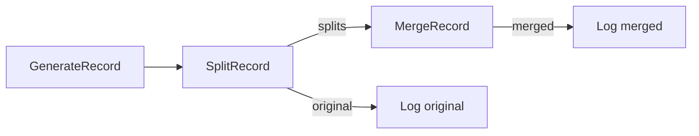
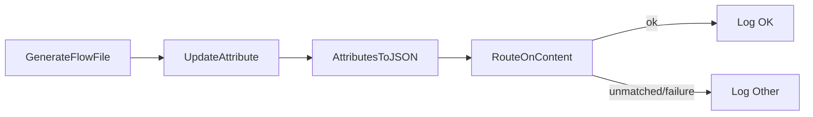

# Test Workflow Suite — LLM Notes

Programmatic automation needs predictable flow definitions to validate end-to-end deployment (create, instantiate, verify). The suite now includes seven workflows — Trivial, Simple, Medium, Complex, Nested, NestedPorts, and PathBranch — providing increasing coverage of NiFi component types and configuration features while remaining deterministic enough for regression testing. All are designed to be torn down and recreated from scratch rather than incrementally updated.

## 1. Trivial Workflow
- **Purpose:** Smoke-test connectivity and REST/CLI call sequencing with the smallest possible footprint.
- **Components:**
  1. `GenerateFlowFile` processor (default text payload, 0-second run schedule for continuous generation).
  2. `LogAttribute` processor to write FlowFile attributes/content to NiFi logs.
- **Connections:** One queue from `GenerateFlowFile` success to `LogAttribute` success.
- **Configuration Notes:**
  - Accept all default processor properties.
  - Use process-group scheduling defaults; no controller services or parameter contexts.
- **Validation Targets:** Processor creation, connection wiring, start/stop operations, basic provenance events.



## 2. Simple Workflow
- **Purpose:** Introduce routing and attribute manipulation to test property configuration and back pressure basics.
- **Components:**
  1. `GenerateRecord` processor using an embedded Avro schema (generates a record with fields `status`, `value`).
  2. `UpdateRecord` to normalize fields (e.g., uppercase `status`).
  3. `QueryRecord` with two relationships—`success` and `failure`—using SQL predicates (route `status='OK'` to success, others to failure).
  4. Two `LogAttribute` processors (one per route).
- **Connections:** Linear pipeline with branching after `QueryRecord`.
- **Configuration Notes:**
  - Add a `JsonTreeReader` and `JsonRecordSetWriter` controller service pair for record processors.
  - Set back pressure threshold on the main connection (e.g., 1000 FlowFiles) to ensure queue settings propagate correctly.
- **Validation Targets:** Controller service provisioning, property JSON payloads, relationship wiring, multi-queue handling.

```mermaid
flowchart LR
    A[GenerateRecord]
    B[UpdateRecord]
    C[QueryRecord]
    D[LogAttribute (success)]
    E[LogAttribute (failure)]

    A --> B --> C
    C -->|status = 'OK'| D
    C -->|status <> 'OK'| E
```

## 3. Medium Workflow
- **Purpose:** Cover external interactions, parameter contexts, and controller dependencies.
- **Components:**
  1. `GenerateFlowFile` to create JSON payloads referencing a REST endpoint path parameter.
  2. `ReplaceText` (or `JoltTransformJSON`) to customize payload based on parameters.
  3. `InvokeHTTP` to call a mock HTTP service (use NiFi’s own `HandleHttpRequest/Response` pair within the same flow or an external test endpoint).
  4. `PutFile` to persist responses on disk.
  5. `LogAttribute` for failure relationship capture.
- **Connections:** Sequential with failure routes from `InvokeHTTP` and `PutFile` into the log.
- **Configuration Notes:**
  - Define a Parameter Context (`API_BASE_URL`, `OUTPUT_DIR`) and bind processors to it.
  - Configure SSL context service if testing secure endpoints.
  - Ensure file output path points to a writable test directory; plan cleanup as part of teardown.
- **Validation Targets:** Parameter context injection, controller service references (SSL, if applicable), external system interaction, failure handling paths.

```mermaid
flowchart LR
    A[GenerateFlowFile] --> B[Transform Payload]
    B --> C[InvokeHTTP]
    C -->|success| D[PutFile]
    C -->|failure| E[LogAttribute (HTTP failure)]
    D -->|failure| F[LogAttribute (write failure)]
```

## 4. Complex Workflow
- **Purpose:** Exercise advanced features—nested process groups, remote connections, record processing, provenance-heavy operations.
- **High-Level Structure:**
  - **Root Process Group**
    - Sub-group `Ingress` handling Site-to-Site push (Remote Process Group ingesting from another NiFi or `HandleHttpRequest`).
    - Sub-group `Processing` performing enrichment and joins:
      - `ListFile` + `FetchFile` pair to ingest reference data.
      - `MergeRecord` to combine incoming stream with reference data via RecordReader/Writer services.
      - `ValidateRecord` enforcing schema compliance.
    - Sub-group `Egress` pushing to two destinations:
      - `PutKafkaRecord_2_0` to publish enriched data.
      - `PutDatabaseRecord` (simulate via embedded Derby/postgres docker) for persistence.
    - Monitoring components: `QueryRecord` for metrics, `PublishJMS` (mock) for alerts.
- **Configuration Notes:**
  - Multiple parameter contexts: one for environment endpoints (Kafka brokers, JDBC URL), another for file paths.
  - Requires several controller services: Avro/JSON readers/writers, DBCP connection pool, Kafka connection pool, JMS context (can use stub provider).
  - Optional `ReportingTask` (e.g., SiteToSiteStatusReportingTask) configured but disabled to confirm automation can handle additional component types.
- **Validation Targets:** Nested process groups, Remote Process Groups, Site-to-Site ports, multiple controller services, parameter inheritance, large component creation counts.
- **Test Harness Considerations:** Provide mock endpoints (dockerized Kafka/Postgres/JMS) or replace with NiFi in-process substitutes (e.g., `HandleHttpResponse`, `PutFile`) when external systems aren’t available.



## 5. Nested Workflow
- Purpose: Validate nested process groups and local wiring without ports.
- Components: A `SubFunction` child group containing `GenerateFlowFile` → `LogAttribute`.
- Validation Targets: Child PG creation, nested component positioning, and deletion order during purge.



## 6. NestedPorts Workflow
- Purpose: Validate input/output ports within a child process group and connections to/from the parent.
- Components: Parent `GenerateFlowFile` → Child `NestedPortsSubflow` (In Port → Log → Out Port) → Parent `LogAttribute`.
- Validation Targets: Port creation and connection wiring across PG boundaries.

```mermaid
flowchart LR
  A[GenerateFlowFile] --> IN[(Nested Sub In)]
  IN --> L[LogAttribute (Nested Sub)] --> OUT[(Nested Sub Out)]
  OUT --> R[LogAttribute (Result)]
```

## 7. PathBranch Workflow
- Purpose: Introduce an attribute-based path branch using `RouteOnAttribute`.
- Components:
  1. `GenerateFlowFile` sets attribute `route` (e.g., `east`).
  2. `RouteOnAttribute` with named properties (`east`, `west`) plus `unmatched`/`failure` handling.
  3. Three `LogAttribute` sinks for each path.
- Connections: `Generate` → `Route` → `Log(east|west|unmatched)`.
- Validation Targets: Multiple dynamic relationships and auto-termination on all sinks; confirms branching semantics.



## 8. SplitMerge Workflow
- Purpose: Exercise record splitting/merging behavior using existing JSON RecordReader/Writer services.
- Components:
  1. `GenerateRecord` emits a batch of records.
  2. `SplitRecord` splits into fixed-size chunks (e.g., 3 per FlowFile).
  3. `MergeRecord` reassembles chunks into a fixed-size group (3) for downstream.
  4. `LogAttribute` processors capture original and merged outputs.
- Validation Targets: Record-oriented processors, relationships (`splits`, `original`, `merged`), correct property normalization.



## 9. ContentAttributeRoute Workflow
- Purpose: Build content from attributes, then route based on content patterns without external systems.
- Components:
  1. `GenerateFlowFile` seeds an empty JSON.
  2. `UpdateAttribute` sets `status` and `message` attributes.
  3. `AttributesToJSON` writes attributes into the FlowFile content.
  4. `RouteOnContent` routes `OK` vs everything else.
  5. Two `LogAttribute` sinks.
- Validation Targets: Attribute→content transforms, regex routing, auto-termination of sinks.



## Usage Notes
- Each workflow should include a scripted teardown path: stop components, delete process group, clean up external artifacts (files, DB tables), and clear mock service state.
- Snapshot the exact component coordinates (bundle artifact/version) used for processors/controller services so programmatic tools can reference consistent components across NiFi versions.
- Keep sample schemas, parameters, and property payloads in source control alongside automation code to ensure reproducibility.
