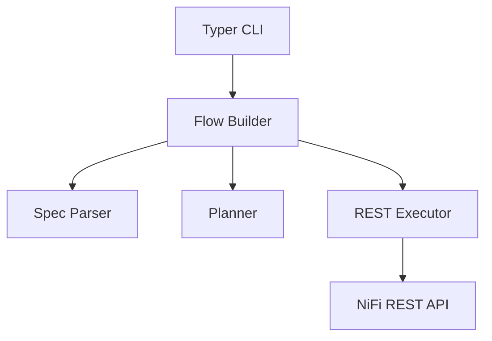

# NiFi Flow Automation – Design Overview

> See also [`design-log.md`](design-log.md) for chronological design discussions and decisions.

## 1. Context & Motivation
Automating NiFi flow creation via a REST-driven CLI provides a repeatable, scriptable way to stand up process groups, processors, connections, and supporting components (controller services, parameter contexts, etc.). The goal is to describe desired flows in declarative YAML and deploy them against any NiFi instance without manual UI steps or custom NiFi plugins.

We assume:
- NiFi exposes its REST API (`/nifi-api`).
- Username/password-based authentication is enabled (or an equivalent token flow).
- Operators want to embed flow deployments in CI/CD pipelines, developer onboarding scripts, or infrastructure bootstrap processes.
- Longer-term, this automation should power an MCP (Model Context Protocol) server that can programmatically construct flows and provide richer, more legible diagrams/layouts than the default NiFi UI export.
- Component-specific requirements are tracked in [`docs/components/`](components) to document processor/controller behaviors that the automation must account for; the candidate lists are generated by scanning NiFi's extension bundles (e.g., `nifi-extension-bundles/nifi-standard-bundle/nifi-standard-processors/src/main/java`).

## 2. Goals & Requirements
- Accept declarative flow specifications describing:
  - Process group(s)
  - Processors (type, bundle, properties)
  - Connections (source/destination relationships)
  - Auto-termination rules
  - Input and output ports
  - Nested process groups
  - References to root-level controller services (mapped via the manifest)
- Deploy flows idempotently (delete/recreate) via CLI commands.
- Fetch NiFi processor metadata at runtime to reduce hardcoded logic.

### Non-Functional Requirements
- Standalone executable outside NiFi’s lifecycle.
- Python-based (for rapid development and broad accessibility).
- Documented schema and architecture.
- Testable (unit tests + future integration tests with dockerized NiFi).
- Extensible to support more complex flows without major rewrites.

## 3. Flow Specification Format
Declarative YAML structure (`flows/NiFi_Flow.yaml` – excerpt):
```yaml
process_group:
  name: NiFi Flow
  position: [0, 0]
  process_groups:
    - name: TrivialFlow
      position: [0, 0]
      processors:
        - id: generate
          name: Generate FlowFile
          type: org.apache.nifi.processors.standard.GenerateFlowFile
          position: [0, 0]
          scheduling_period: '1 min'
          properties:
            Batch Size: "1"
        - id: log
          name: Log Attribute
          type: org.apache.nifi.processors.standard.LogAttribute
          position: [400, 0]
      connections:
        - name: Generate to Log
          source: generate
          destination: log
          relationships: [success]
      auto_terminate:
        log:
          - success
    - name: SimpleWorkflow
      position: [800, 0]
      processors:
        - id: generate
          name: GenerateRecord
          type: org.apache.nifi.processors.standard.GenerateRecord
          position: [0, 0]
          scheduling_period: '1 min'
          properties:
            record-writer: json-writer
            number-of-records: "1"
            nullable-fields: "false"
            null-percentage: "0.0"
            schema-text: |
              { "type": "record", "name": "test", "fields": [
                  { "name": "status", "type": "string" },
                  { "name": "value", "type": "int" }
                ]
              }
        - id: update
          name: UpdateRecord
          type: org.apache.nifi.processors.standard.UpdateRecord
          position: [400, 0]
          properties:
            Record Reader: json-reader
            Record Writer: json-writer
            /status: "UPPER(/status)"
        - id: query
          name: QueryRecord
          type: org.apache.nifi.processors.standard.QueryRecord
          position: [800, 0]
          properties:
            record-reader: json-reader
            record-writer: json-writer
            success: "SELECT * FROM FLOWFILE WHERE status = 'OK'"
            failure: "SELECT * FROM FLOWFILE WHERE status <> 'OK'"
        - id: log_success
          name: LogAttribute (Success)
          type: org.apache.nifi.processors.standard.LogAttribute
          position: [1200, -200]
        - id: log_failure
          name: LogAttribute (Failure)
          type: org.apache.nifi.processors.standard.LogAttribute
          position: [1200, 200]
      connections:
        - name: Generate to Update
          source: generate
          destination: update
          relationships: [success]
        - name: Update to Query
          source: update
          destination: query
          relationships: [success]
        - name: Query to Log Success
          source: query
          destination: log_success
          relationships: [success]
        - name: Query to Log Failure
          source: query
          destination: log_failure
          relationships: [failure]
      auto_terminate:
        log_success:
          - success
        log_failure:
          - success
    # Additional child groups (MediumWorkflow, ComplexWorkflow) follow similar patterns.
```

**Key rules**
- The top-level `process_group.name` must be `NiFi Flow`; its contents are deployed directly into NiFi's
  built-in root process group.
- Nested groups are declared via the `process_groups` array inside any group.
- `processor.id` is local to its containing group (used in connections & spec); NiFi assigns UUIDs on create.
- `type` refers to the fully-qualified processor class; NiFi bundle info is resolved via `/flow/processor-types`.
- `connections.relationships` defaults to `[success]` if omitted.
- `auto_terminate` lists relationships to auto-terminate per processor (future: allow defaults from processor metadata).

**Spec fields currently supported**
- `processors`, `connections`, `auto_terminate` (initial MVP scope)
- `process_groups` for nested structures (e.g., `NestedWorkflow` containing `SubFunction`)
- `ports` with separate lists for `input_ports` and `output_ports`
- Controller-service references that resolve against `automation/manifest/controller-services.json`
- Optional scheduling hints per processor via `scheduling_period` (e.g., `'1 min'`) and `scheduling_strategy`; omit them to keep NiFi's defaults.

**Future additions still under design**
- `parameter_context`
- `schedule` (concurrency, run duration)
- `layout` hints (e.g., layered grid spacing) to guide auto-positioning while keeping overrides optional.

The default `flows/NiFi_Flow.yaml` currently provisions six child groups (TrivialFlow, SimpleWorkflow, MediumWorkflow, ComplexWorkflow, NestedWorkflow, NestedPortsWorkflow). The `NestedWorkflow` example demonstrates a process group that
contains a nested `process_groups` entry (`SubFunction`) for sub-flow logic. Single-flow specs—
`flows/trivial.yaml`, `flows/simple.yaml`, `flows/medium.yaml`, `flows/complex.yaml`, `flows/nested.yaml`, `flows/nested_ports.yaml`—share the
same root schema but contain just one child `process_group` for targeted debugging.

### 3.1 Comparison with NiFi FlowSnapshot JSON
NiFi exports versioned flows as FlowSnapshot JSON. For the trivial example, the relevant portion looks like:

```json
{
  "flowContents": {
    "processGroups": [],
    "inputPorts": [],
    "outputPorts": [],
    "processors": [
      {
        "identifier": "e06388b5-0199-1000-7030-a599d997dce5",
        "name": "Generate FlowFile",
        "type": "org.apache.nifi.processors.standard.GenerateFlowFile",
        "bundle": {
          "group": "org.apache.nifi",
          "artifact": "nifi-standard-nar",
          "version": "2.0.0"
        },
        "properties": {
          "Batch Size": "1"
        },
        "position": { "x": 0.0, "y": 0.0 }
      },
      {
        "identifier": "e063895d-0199-1000-05ee-df572c778106",
        "name": "Log Attribute",
        "type": "org.apache.nifi.processors.standard.LogAttribute",
        "bundle": { "...": "..." },
        "properties": {},
        "position": { "x": 400.0, "y": 0.0 },
        "config": {
          "autoTerminatedRelationships": ["success"]
        }
      }
    ],
    "connections": [
      {
        "identifier": "e0638a19-0199-1000-d16d-4a8010060c74",
        "name": "Generate to Log",
        "source": {
          "id": "e06388b5-0199-1000-7030-a599d997dce5",
          "type": "PROCESSOR"
        },
        "destination": {
          "id": "e063895d-0199-1000-05ee-df572c778106",
          "type": "PROCESSOR"
        },
        "selectedRelationships": ["success"],
        "flowFileExpiration": "0 sec",
        "backPressureObjectThreshold": 10000,
        "backPressureDataSizeThreshold": "1 GB",
        "loadBalanceStrategy": "DO_NOT_LOAD_BALANCE"
      }
    ]
  }
}
```

- **Identifiers** – FlowSnapshot uses NiFi-generated UUIDs; the YAML spec uses human-readable aliases (`generate`, `log`) which are mapped during deployment.
- **Bundles & defaults** – FlowSnapshot embeds the resolved bundle coordinates, queue settings, load-balancing policy, etc. The spec omits these unless overrides are needed; the deployer fills in defaults from metadata.
- **Auto-termination** – In FlowSnapshot the flag appears in the processor `config.autoTerminatedRelationships`; in the spec it lives under `auto_terminate`.
- **Layout** – FlowSnapshot stores explicit `position` values for all components. The spec allows positions to be omitted; the deployer will auto-layout nodes by default (with future layout strategies configurable) while still respecting explicit coordinates.
- **Structure** – FlowSnapshot is verbose and tightly coupled to NiFi’s internal DTOs, whereas the spec keeps only the ergonomics necessary to describe intent. The deployer bridges the gap by populating required fields when calling the REST API.

### 3.2 Process Group Reuse (Deferred)
Reusable sub process groups remain a design goal, but the automation currently performs whole-process-group delete/recreate operations only. Selective refresh of individual child groups (while preserving siblings) is explicitly deferred to a later phase so that the present implementation stays simple and predictable. Future work will revisit library references, planner metadata, and partial replacement semantics once the base deployer is stable.

## 4. Architecture Overview


- **CLI**: Typer-based commands (`auth-token`, `flow-summary`, `deploy-flow`); reads `.env` for base URL & credentials.
- **Spec Parser** (`flow_builder.py` – `load_flow_spec`):
  - Parses YAML into dataclasses (`FlowSpec`, `ProcessorSpec`, `ConnectionSpec`).
  - Validates presence of required fields (`id`, `type`, valid references).
- **Planner** (currently minimal):
  - Computes deletion plan (checks for existing PG by name and deletes recursively).
  - Maintains mapping of spec processor IDs -> NiFi processor UUIDs.
- **Executor** (`FlowDeployer` using `NiFiClient`):
  - Creates PG (`POST /process-groups/{id}/process-groups`).
  - Adds processors (bundle lookup via `/flow/processor-types`).
  - Updates processor auto-termination if specified.
  - Creates connections with required queue defaults.
- **NiFiClient**: thin wrapper around httpx with NiFi-specific helpers:
  - `create_process_group`, `delete_process_group`
  - `create_processor` (bundle resolution)
  - `create_connection`
  - `update_processor_autoterminate`
  - `find_child_process_group_by_name`

## 5. Processor Metadata Strategy
To avoid hardcoding processor-specific logic (properties, relationships, controller service requirements), consult NiFi’s REST metadata:
1. `/flow/processors/types`: lists all available processors with bundle info.
2. `/flow/processors/{type}?bundleGroup=&bundleArtifact=&bundleVersion=`: returns `PropertyDescriptorDTO`, relationship info, auto-terminate capability, validation details.

Planned enhancements:
- Validate spec properties against descriptors (required, allowable values).
- Auto-fill controller service stubs if needed.
- Infer default auto-termination flags (when relationship is not referenced downstream).

### 5.1 Spec Property Validation
- **Metadata source**: Fetch `propertyDescriptors` from `/nifi-api/flow/processors/{type}` (scoped by bundle) and cache them alongside bundle lookups.
- **Required fields**: For each descriptor where `required=true` and no default value exists, assert the spec supplies a non-empty value (after trimming). Raise a validation error before any REST calls mutate NiFi.
- **Allowable values**: When `allowableValues` are published, accept either the canonical `value` or `displayName` and normalize to the canonical form prior to submission. Flag mismatches with a clear error that lists permitted options.
- **Sensitive properties**: Avoid logging raw values; validation errors redact sensitive fields (identified via `sensitive=true`) by replacing payloads with `"<hidden>"`.
- **Extensibility**: Validation happens in the planner stage so we can add future checks (e.g., regex, controller-service existence) without touching executor logic.

### 5.2 Controller Service Stub Generation
- **Detection**: Inspect descriptors where `identifiesControllerService=true` and capture the required controller service interface (`controllerServiceDefinition`).
- **Stub registry**: Maintain an in-memory plan of controller services to ensure each required definition is created once per process group. Name convention: `<ProcessorName>-<PropertyName>-Service`.
- **Creation flow**:
  1. Before processor creation, ensure stubs exist via `POST /process-groups/{pgId}/controller-services`.
  2. Capture service IDs and inject them into the processor property map so the processor references the freshly created stub.
  3. Keep stubs disabled by default; future phases can wire them to concrete implementations or allow operators to supply overrides via the spec.
- **Overrides**: If the spec already provides a value (interpreted as an existing controller service ID or reference), skip stub creation and preserve the supplied value.
- **Lifecycle**: During delete/redeploy of a managed process group, associated stubs are also removed since they live under the same PG scope.
- For the root-level provisioning workflow that feeds these stubs, see
  [`controller-services-design.md`](controller-services-design.md).

### 5.3 Auto-Termination Inference
- **Relationship catalog**: Use processor metadata (`relationships`) to understand all possible relationships and which are auto-terminated by default.
- **Connection graph**: Build a map of outgoing relationships consumed by connections in the spec. Any relationship not connected downstream is considered a candidate for auto-termination.
- **Rule set**:
  - If the metadata marks a relationship as `autoTerminatedByDefault`, automatically include it unless the spec explicitly routes it.
  - For relationships without a default, only auto-terminate if the spec explicitly requests it to avoid surprising behavior.
- **Implementation**: Extend planner to augment `auto_terminate` entries with inferred relationships. Executors continue to apply the final list via existing `update_processor_autoterminate` logic.
- **Transparency**: Surface the inferred relationships during dry-run/plan output so users understand which relationships will be terminated automatically.

## 6. REST Operations (current coverage)
1. **Authentication**: `POST /access/token` to obtain JWT (HTTP 200 or 201).
2. **Existing PG lookup**: `GET /flow/process-groups/root` (fetch child list).
3. **Deletion**: `DELETE /process-groups/{id}?recursive=true&version=X`.
4. **Creation**:
   - ProcessGroup: `POST /process-groups/root/process-groups`
   - Processor: `POST /process-groups/{pg_id}/processors`
   - Connection: `POST /process-groups/{pg_id}/connections`
5. **Updates**:
   - Processor auto-termination: `PUT /processors/{id}` with updated config.

Error handling:
- Authentication failure -> CLI prints error & exits.
- NiFi 4xx/5xx -> raise `FlowDeploymentError` with details (todo: richer diagnostics with NiFi JSON payload).
- Connection creation now includes required queue/backpressure fields to avoid 500 responses.

## 7. Usage Workflow
1. **Environment setup** (from repo root):
   ```bash
   cd automation
   uv venv --clear
   source .venv/bin/activate
   uv pip install -e .[dev]
   ```
2. **Configure `.env`** (repo root) so the scripts can source credentials automatically:
   ```
   NIFI_BASE_URL="https://localhost:8443/nifi-api"
   NIFI_USERNAME="admin"
   NIFI_PASSWORD="secret"
   ```
3. **Standard deployment pipeline**:
   ```bash
   # Purge, provision manifest services, deploy default flow
   .venv/bin/python scripts/deploy_flows.py automation/flows/NiFi_Flow.yaml
   ```
   - Add additional specs to the command to deploy multiple flows in sequence.
   - Use `--no-purge` only when you are certain the instance is already clean.
4. **Integration tests**:
   ```bash
   scripts/run_integration_suite.sh           # purges + pytest + diagnostics
   scripts/run_integration_suite.sh automation/flows/complex.yaml  # targeted flow
   ```
5. **Diagnostics-only pass**:
   ```bash
   .venv/bin/python scripts/check_invalid_components.py
   ```
6. **Idempotency**: Deployments delete/recreate the addressed process groups inside the `NiFi Flow` root PG, ensuring identical runs produce identical structures (assuming purge succeeded).

## 8. Backlog & Enhancements
- **Spec validation**: Move ad-hoc checks into typed models (likely `pydantic`) so invalid specs fail before REST calls.
- **Parameter contexts**: Allow specs to declare a parameter context per process group and bind it automatically.
- **Processor scheduling**: Capture run-state (RUNNING vs STOPPED) and concurrent tasks in the spec for post-deploy control.
- **Layout guidance**: Introduce optional layout hints (grid spacing, alignments) to reduce overlapping processor positions.
- **Teardown-only command**: Provide a script to remove specific child groups without a full purge when targeted cleanup is safe.
- **Metadata caching**: Cache processor/controller descriptors between runs to reduce REST chatter during large deployments.
- **Spec templating**: Investigate reusable fragments or Jinja-style templating for repeated subflows once controller-service reuse stabilises.

## 9. Testing & Diagnostics
- Unit tests cover spec parsing, controller-service provisioning, and flow-builder helpers (`automation/tests/`).
- Integration suite (`scripts/run_integration_suite.sh`) purges once, ensures controller services exist, deploys the chosen flow(s), and fails on invalid processors, invalid ports, missing child groups, missing ports, or unexpected bulletins.
- Diagnostics module (`nifi_automation.diagnostics`) exposes reusable helpers:
  - `collect_invalid_processors`
  - `collect_invalid_ports`
  - `check_invalid_components.py` wrapper emitting JSON for both
- Targeted integration runs accept specific specs, e.g. `scripts/run_integration_suite.sh automation/flows/medium.yaml`.

## 10. Known Risks / Edge Cases
- NiFi version mismatch: processors may change properties between versions; metadata fetch mitigates but requires runtime queries.
- Authentication methods: currently assumes username/password; need extension for certificates or OIDC.
- Large flows: sequential REST calls may become slow; consider parallelism (with caution re: revision handling).
- Error feedback: NiFi sometimes returns generic 500 without detailed message; log response text to aid debugging.
- Root deployment: Automation assumes the built-in root PG is named `NiFi Flow` and deploys directly within it. Any manual rename breaks deployments until the manifest/specs are updated.
- Purge conflicts: Deleting ports with active connections currently produces HTTP 409 responses; purge script improvements are in progress to tear down connections before port deletion.
- Repository state: Delete/recreate wipes PG state each time—acceptable for bootstrap/testing but unsuitable for production reconciliation (explicitly out of scope).

## 11. Tooling Entry Points
- `scripts/deploy_flows.py` – purge (unless `--no-purge`), provision manifest services, deploy supplied specs.
- `scripts/run_integration_suite.sh` – convenience wrapper that purges, sets flow list, runs pytest integration suite, and captures diagnostics.
- `scripts/check_invalid_components.py` – emits JSON of invalid processors/ports and exits non-zero if any exist.
- `scripts/fetch_invalid_processors.py` – legacy processor-only diagnostic retained for compatibility.
- `scripts/purge_nifi_root.py` – recursive purge of the root PG (queues, processors, connections, ports, child groups, root-level services).

## 12. References
- Apache NiFi REST API docs: https://nifi.apache.org/docs/nifi-docs/rest-api
- Processor descriptor DTOs: `/nifi-api/flow/processors/types`, `/nifi-api/flow/processors/{type}`
- NiFi CLI (Java) for comparison: `nifi-toolkit`
