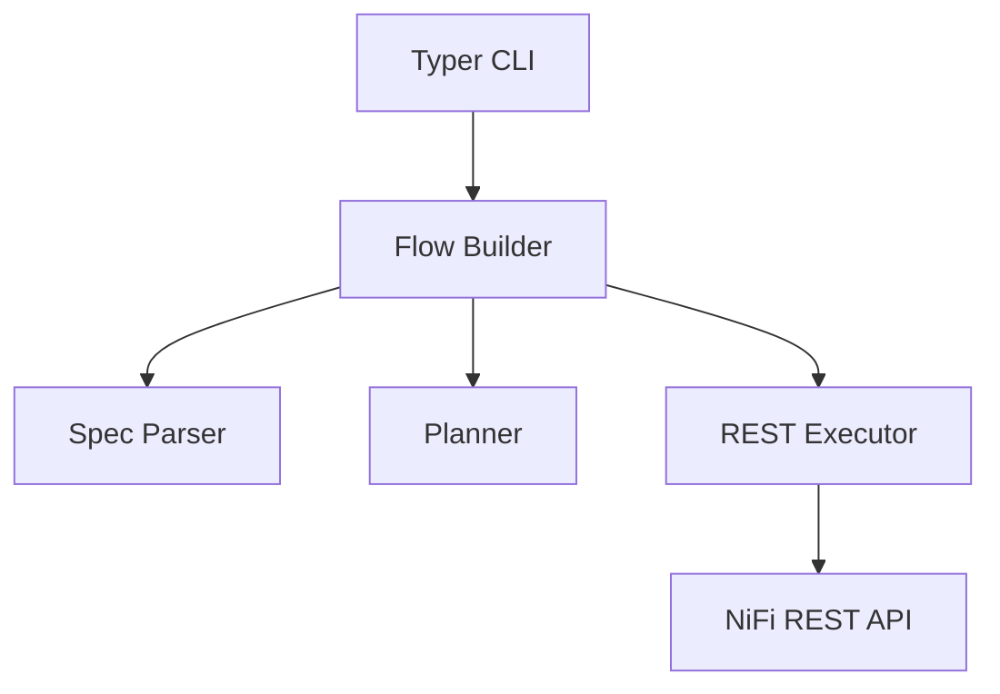

# NiFi Flow Automation – Design Overview

> See also [`design-log.md`](design-log.md) for chronological design discussions and decisions.

## 1. Context & Motivation
Automating NiFi flow creation via a REST-driven CLI provides a repeatable, scriptable way to stand up process groups, processors, connections, and supporting components (controller services, parameter contexts, etc.). The goal is to describe desired flows in declarative YAML and deploy them against any NiFi instance without manual UI steps or custom NiFi plugins.

We assume:
- NiFi exposes its REST API (`/nifi-api`).
- Username/password-based authentication is enabled (or an equivalent token flow).
- Operators want to embed flow deployments in CI/CD pipelines, developer onboarding scripts, or infrastructure bootstrap processes.
- Longer-term, this automation should power an MCP (Model Context Protocol) server that can programmatically construct flows and provide richer, more legible diagrams/layouts than the default NiFi UI export.
- Component-specific requirements are tracked in [`docs/components/`](components) to document processor/controller behaviors that the automation must account for; the candidate lists are generated by scanning NiFi's extension bundles (e.g., `nifi-extension-bundles/nifi-standard-bundle/nifi-standard-processors/src/main/java`).

## 2. Goals & Requirements
### Functional Goals
- Accept declarative flow specifications describing:
  - Process group(s)
  - Processors (type, bundle, properties)
  - Connections (source/destination relationships)
  - Auto-termination rules
  - Planned extensions: controller services, parameter contexts, ports, nested groups
- Deploy flows idempotently (delete/recreate) via CLI commands.
- Fetch NiFi processor metadata at runtime to reduce hardcoded logic.

### Non-Functional Requirements
- Standalone executable outside NiFi’s lifecycle.
- Python-based (for rapid development and broad accessibility).
- Documented schema and architecture.
- Testable (unit tests + future integration tests with dockerized NiFi).
- Extensible to support more complex flows without major rewrites.

## 3. Flow Specification Format
Declarative YAML structure (`flows/*.yaml`):
```yaml
process_group:
  name: TrivialFlow
  position: [0, 0]

processors:
  - id: generate
    name: Generate FlowFile
    type: org.apache.nifi.processors.standard.GenerateFlowFile
    position: [0, 0]
    properties:
      GenerateFlowFile.BatchSize: "1"
  - id: log
    name: Log Attribute
    type: org.apache.nifi.processors.standard.LogAttribute
    position: [400, 0]

connections:
  - name: Generate to Log
    source: generate
    destination: log
    relationships: [success]

auto_terminate:
  log:
    - success
```

**Key rules**
- `process_group.name` becomes the new PG under NiFi root (or configurable parent).
- `processor.id` is a local alias (used in connections & spec); a NiFi-generated UUID is assigned on create.
- `type` refers to the fully-qualified processor class; NiFi bundle info is resolved via `/flow/processor-types`.
- `connections.relationships` defaults to `[success]` if omitted.
- `auto_terminate` lists relationships to auto-terminate per processor (future: allow defaults from processor metadata).

**Future fields** (planned):
- `controller_services`
- `parameter_context`
- `ports` (input/output)
- `nested_groups`
- `schedule` (concurrency, run duration)
- `layout` options (e.g., `layout: layered`, `spacing: {x: 400, y: 200}`) to guide auto-positioning while keeping overrides optional.

### 3.1 Comparison with NiFi FlowSnapshot JSON
NiFi exports versioned flows as FlowSnapshot JSON. For the trivial example, the relevant portion looks like:

```json
{
  "flowContents": {
    "processGroups": [],
    "inputPorts": [],
    "outputPorts": [],
    "processors": [
      {
        "identifier": "e06388b5-0199-1000-7030-a599d997dce5",
        "name": "Generate FlowFile",
        "type": "org.apache.nifi.processors.standard.GenerateFlowFile",
        "bundle": {
          "group": "org.apache.nifi",
          "artifact": "nifi-standard-nar",
          "version": "2.0.0"
        },
        "properties": {
          "GenerateFlowFile.BatchSize": "1"
        },
        "position": { "x": 0.0, "y": 0.0 }
      },
      {
        "identifier": "e063895d-0199-1000-05ee-df572c778106",
        "name": "Log Attribute",
        "type": "org.apache.nifi.processors.standard.LogAttribute",
        "bundle": { "...": "..." },
        "properties": {},
        "position": { "x": 400.0, "y": 0.0 },
        "config": {
          "autoTerminatedRelationships": ["success"]
        }
      }
    ],
    "connections": [
      {
        "identifier": "e0638a19-0199-1000-d16d-4a8010060c74",
        "name": "Generate to Log",
        "source": {
          "id": "e06388b5-0199-1000-7030-a599d997dce5",
          "type": "PROCESSOR"
        },
        "destination": {
          "id": "e063895d-0199-1000-05ee-df572c778106",
          "type": "PROCESSOR"
        },
        "selectedRelationships": ["success"],
        "flowFileExpiration": "0 sec",
        "backPressureObjectThreshold": 10000,
        "backPressureDataSizeThreshold": "1 GB",
        "loadBalanceStrategy": "DO_NOT_LOAD_BALANCE"
      }
    ]
  }
}
```

- **Identifiers** – FlowSnapshot uses NiFi-generated UUIDs; the YAML spec uses human-readable aliases (`generate`, `log`) which are mapped during deployment.
- **Bundles & defaults** – FlowSnapshot embeds the resolved bundle coordinates, queue settings, load-balancing policy, etc. The spec omits these unless overrides are needed; the deployer fills in defaults from metadata.
- **Auto-termination** – In FlowSnapshot the flag appears in the processor `config.autoTerminatedRelationships`; in the spec it lives under `auto_terminate`.
- **Layout** – FlowSnapshot stores explicit `position` values for all components. The spec allows positions to be omitted; the deployer will auto-layout nodes by default (with future layout strategies configurable) while still respecting explicit coordinates.
- **Structure** – FlowSnapshot is verbose and tightly coupled to NiFi’s internal DTOs, whereas the spec keeps only the ergonomics necessary to describe intent. The deployer bridges the gap by populating required fields when calling the REST API.

### 3.2 Process Group Reuse & Override Strategy
NiFi projects commonly encapsulate reusable logic inside nested process groups (PGs). The automation must support pulling these PGs from a curated library and selectively refreshing them without disturbing sibling PGs or processors hosted in the same parent scope.

- **Library-first mindset**: The spec should allow `process_groups` entries that refer to catalogued subflows (e.g., `ref: LogRequest`) rather than inlining their full definition. The deployer will resolve the reference to a concrete template (likely another YAML asset) at plan time.
- **Override granularity**: Updates continue to operate as delete + rebuild operations, but the boundary shifts from individual processors to the referenced child PG. When a single PG is refreshed inside a parent that contains three children, only the targeted child is deleted/recreated; the remaining two child PGs and any root-level processors under the parent stay untouched.
- **Planner implications**: The planning phase needs to classify each child PG as either `managed` (declared by the current spec) or `unmanaged` (pre-existing, not slated for replacement). Managed PGs should carry metadata such as `ref`, version, and optional override properties so the planner can decide whether a diff warrants deletion. Unmanaged PGs must always be preserved.
- **Executor behavior**: The executor will locate the live child PG by name/annotation, delete it recursively when an override is requested, and then hydrate the replacement from the referenced template. It must avoid touching processors that live directly under the parent PG unless the parent itself is being rebuilt.
- **Open questions**:
  - How to annotate deployed PGs so future runs can match them back to their library references (labels, parameter context metadata, custom component annotation)?
  - What controls whether a reference is refreshed (always, version bump, explicit `force` flag)?
  - How do we treat nested references (a referenced PG that itself references other PGs)?
  - Where should the library live (local repo folder, remote registry) and how do we version entries?

The section above defines direction rather than a finalized schema. Implementation tasks include extending the YAML schema, enriching the planner with dependency awareness, and codifying the matching/annotation strategy so partial PG refreshes are deterministic.

## 4. Architecture Overview


- **CLI**: Typer-based commands (`auth-token`, `flow-summary`, `deploy-flow`); reads `.env` for base URL & credentials.
- **Spec Parser** (`flow_builder.py` – `load_flow_spec`):
  - Parses YAML into dataclasses (`FlowSpec`, `ProcessorSpec`, `ConnectionSpec`).
  - Validates presence of required fields (`id`, `type`, valid references).
- **Planner** (currently minimal):
  - Computes deletion plan (checks for existing PG by name and deletes recursively).
  - Maintains mapping of spec processor IDs -> NiFi processor UUIDs.
- **Executor** (`FlowDeployer` using `NiFiClient`):
  - Creates PG (`POST /process-groups/{id}/process-groups`).
  - Adds processors (bundle lookup via `/flow/processor-types`).
  - Updates processor auto-termination if specified.
  - Creates connections with required queue defaults.
- **NiFiClient**: thin wrapper around httpx with NiFi-specific helpers:
  - `create_process_group`, `delete_process_group`
  - `create_processor` (bundle resolution)
  - `create_connection`
  - `update_processor_autoterminate`
  - `find_child_process_group_by_name`

## 5. Processor Metadata Strategy
To avoid hardcoding processor-specific logic (properties, relationships, controller service requirements), consult NiFi’s REST metadata:
1. `/flow/processors/types`: lists all available processors with bundle info.
2. `/flow/processors/{type}?bundleGroup=&bundleArtifact=&bundleVersion=`: returns `PropertyDescriptorDTO`, relationship info, auto-terminate capability, validation details.

Planned enhancements:
- Validate spec properties against descriptors (required, allowable values).
- Auto-fill controller service stubs if needed.
- Infer default auto-termination flags (when relationship is not referenced downstream).

### 5.1 Spec Property Validation
- **Metadata source**: Fetch `propertyDescriptors` from `/nifi-api/flow/processors/{type}` (scoped by bundle) and cache them alongside bundle lookups.
- **Required fields**: For each descriptor where `required=true` and no default value exists, assert the spec supplies a non-empty value (after trimming). Raise a validation error before any REST calls mutate NiFi.
- **Allowable values**: When `allowableValues` are published, accept either the canonical `value` or `displayName` and normalize to the canonical form prior to submission. Flag mismatches with a clear error that lists permitted options.
- **Sensitive properties**: Avoid logging raw values; validation errors redact sensitive fields (identified via `sensitive=true`) by replacing payloads with `"<hidden>"`.
- **Extensibility**: Validation happens in the planner stage so we can add future checks (e.g., regex, controller-service existence) without touching executor logic.

### 5.2 Controller Service Stub Generation
- **Detection**: Inspect descriptors where `identifiesControllerService=true` and capture the required controller service interface (`controllerServiceDefinition`).
- **Stub registry**: Maintain an in-memory plan of controller services to ensure each required definition is created once per process group. Name convention: `<ProcessorName>-<PropertyName>-Service`.
- **Creation flow**:
  1. Before processor creation, ensure stubs exist via `POST /process-groups/{pgId}/controller-services`.
  2. Capture service IDs and inject them into the processor property map so the processor references the freshly created stub.
  3. Keep stubs disabled by default; future phases can wire them to concrete implementations or allow operators to supply overrides via the spec.
- **Overrides**: If the spec already provides a value (interpreted as an existing controller service ID or reference), skip stub creation and preserve the supplied value.
- **Lifecycle**: During delete/redeploy of a managed process group, associated stubs are also removed since they live under the same PG scope.

### 5.3 Auto-Termination Inference
- **Relationship catalog**: Use processor metadata (`relationships`) to understand all possible relationships and which are auto-terminated by default.
- **Connection graph**: Build a map of outgoing relationships consumed by connections in the spec. Any relationship not connected downstream is considered a candidate for auto-termination.
- **Rule set**:
  - If the metadata marks a relationship as `autoTerminatedByDefault`, automatically include it unless the spec explicitly routes it.
  - For relationships without a default, only auto-terminate if the spec explicitly requests it to avoid surprising behavior.
- **Implementation**: Extend planner to augment `auto_terminate` entries with inferred relationships. Executors continue to apply the final list via existing `update_processor_autoterminate` logic.
- **Transparency**: Surface the inferred relationships during dry-run/plan output so users understand which relationships will be terminated automatically.

## 6. REST Operations (current coverage)
1. **Authentication**: `POST /access/token` to obtain JWT (HTTP 200 or 201).
2. **Existing PG lookup**: `GET /flow/process-groups/root` (fetch child list).
3. **Deletion**: `DELETE /process-groups/{id}?recursive=true&version=X`.
4. **Creation**:
   - ProcessGroup: `POST /process-groups/root/process-groups`
   - Processor: `POST /process-groups/{pg_id}/processors`
   - Connection: `POST /process-groups/{pg_id}/connections`
5. **Updates**:
   - Processor auto-termination: `PUT /processors/{id}` with updated config.

Error handling:
- Authentication failure -> CLI prints error & exits.
- NiFi 4xx/5xx -> raise `FlowDeploymentError` with details (todo: richer diagnostics with NiFi JSON payload).
- Connection creation now includes required queue/backpressure fields to avoid 500 responses.

## 7. Usage Workflow
1. **Environment setup**:
   ```bash
   cd automation
   uv venv --clear
   source .venv/bin/activate
   uv pip install -e .[dev]
   ```
2. **Configure `.env`** (repo root):
   ```
   NIFI_BASE_URL="https://localhost:8443/nifi-api"
   NIFI_USERNAME="admin"
   NIFI_PASSWORD="secret"
   ```
3. **Run commands**:
   ```bash
   nifi-automation auth-token        # verify token retrieval
   nifi-automation flow-summary      # confirm API access
   nifi-automation deploy-flow flows/trivial.yaml  # deploys (delete+create)
   ```
4. **Idempotency**: Each deploy removes the existing PG with the same name under the parent (root) before recreation.
5. **Teardown** (future command): plan to add `nifi-automation delete-flow <name>` that deletes the PG only.

## 8. Planned Enhancements
- **Spec validation**: Implement `pydantic` models for structure/requirement checks.
- **Controller services**: Create, configure, and enable services referenced by processors.
- **Parameter contexts**: Support PG parameter contexts defined in spec.
- **Ports & nested groups**: Extend spec to hierarchical flows (subgroups, remote ports).
- **Start/stop**: Control processor run status post-deployment.
- **Teardown/cleanup** command.
- **Integration tests**: Docker-compose environment running NiFi to validate CLI end-to-end (deploy + teardown).
- **Metadata caching**: Cache processor descriptors and relationships to speed repeated deployments.
- **Spec templating**: Possibly allow import of partial specs or templating (Jinja?) for reuse across flows.

## 9. Known Risks / Edge Cases
- NiFi version mismatch: processors may change properties between versions; metadata fetch mitigates but requires runtime queries.
- Authentication methods: currently assumes username/password; need extension for certificates or OIDC.
- Large flows: sequential REST calls may become slow; consider parallelism (with caution re: revision handling).
- Error feedback: NiFi sometimes returns generic 500 without detailed message; log response text to aid debugging.
- Repository state: Delete/recreate wipes PG state each time— acceptable for initial automation but may need an “update” mode later.

## 10. References
- Apache NiFi REST API docs: https://nifi.apache.org/docs/nifi-docs/rest-api
- Processor descriptor DTOs: `/nifi-api/flow/processors/types`, `/nifi-api/flow/processors/{type}`
- NiFi CLI (Java) for comparison: `nifi-toolkit`
