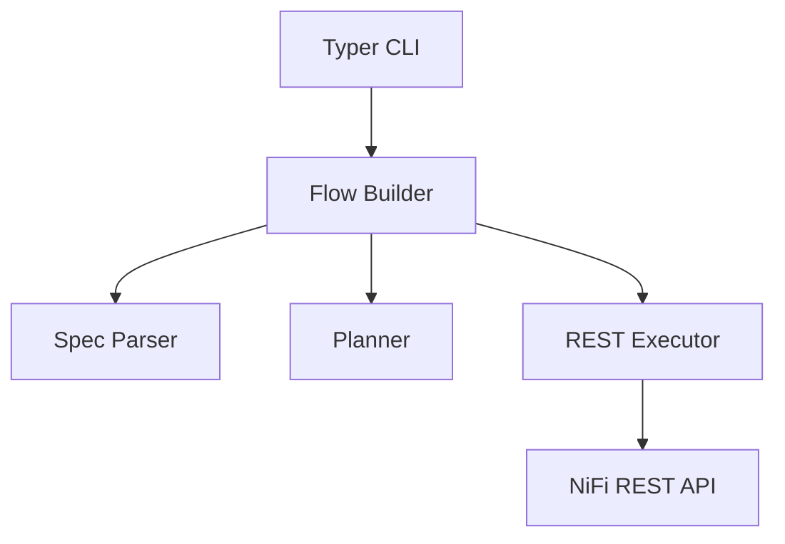

# NiFi Flow Automation – Design Overview

## 1. Context & Motivation
Automating NiFi flow creation via a REST-driven CLI provides a repeatable, scriptable way to stand up process groups, processors, connections, and supporting components (controller services, parameter contexts, etc.). The goal is to describe desired flows in declarative YAML and deploy them against any NiFi instance without manual UI steps or custom NiFi plugins.

We assume:
- NiFi exposes its REST API (`/nifi-api`).
- Username/password-based authentication is enabled (or an equivalent token flow).
- Operators want to embed flow deployments in CI/CD pipelines, developer onboarding scripts, or infrastructure bootstrap processes.

## 2. Goals & Requirements
### Functional Goals
- Accept declarative flow specifications describing:
  - Process group(s)
  - Processors (type, bundle, properties)
  - Connections (source/destination relationships)
  - Auto-termination rules
  - Planned extensions: controller services, parameter contexts, ports, nested groups
- Deploy flows idempotently (delete/recreate) via CLI commands.
- Fetch NiFi processor metadata at runtime to reduce hardcoded logic.

### Non-Functional Requirements
- Standalone executable outside NiFi’s lifecycle.
- Python-based (for rapid development and broad accessibility).
- Documented schema and architecture.
- Testable (unit tests + future integration tests with dockerized NiFi).
- Extensible to support more complex flows without major rewrites.

## 3. Flow Specification Format
Declarative YAML structure (`flows/*.yaml`):
```yaml
process_group:
  name: TrivialFlow
  position: [0, 0]

processors:
  - id: generate
    name: Generate FlowFile
    type: org.apache.nifi.processors.standard.GenerateFlowFile
    position: [0, 0]
    properties:
      GenerateFlowFile.BatchSize: "1"
  - id: log
    name: Log Attribute
    type: org.apache.nifi.processors.standard.LogAttribute
    position: [400, 0]

connections:
  - name: Generate to Log
    source: generate
    destination: log
    relationships: [success]

auto_terminate:
  log:
    - success
```

**Key rules**
- `process_group.name` becomes the new PG under NiFi root (or configurable parent).
- `processor.id` is a local alias (used in connections & spec); a NiFi-generated UUID is assigned on create.
- `type` refers to the fully-qualified processor class; NiFi bundle info is resolved via `/flow/processor-types`.
- `connections.relationships` defaults to `[success]` if omitted.
- `auto_terminate` lists relationships to auto-terminate per processor (future: allow defaults from processor metadata).

**Future fields** (planned):
- `controller_services`
- `parameter_context`
- `ports` (input/output)
- `nested_groups`
- `schedule` (concurrency, run duration)

## 4. Architecture Overview


- **CLI**: Typer-based commands (`auth-token`, `flow-summary`, `deploy-flow`); reads `.env` for base URL & credentials.
- **Spec Parser** (`flow_builder.py` – `load_flow_spec`):
  - Parses YAML into dataclasses (`FlowSpec`, `ProcessorSpec`, `ConnectionSpec`).
  - Validates presence of required fields (`id`, `type`, valid references).
- **Planner** (currently minimal):
  - Computes deletion plan (checks for existing PG by name and deletes recursively).
  - Maintains mapping of spec processor IDs -> NiFi processor UUIDs.
- **Executor** (`FlowDeployer` using `NiFiClient`):
  - Creates PG (`POST /process-groups/{id}/process-groups`).
  - Adds processors (bundle lookup via `/flow/processor-types`).
  - Updates processor auto-termination if specified.
  - Creates connections with required queue defaults.
- **NiFiClient**: thin wrapper around httpx with NiFi-specific helpers:
  - `create_process_group`, `delete_process_group`
  - `create_processor` (bundle resolution)
  - `create_connection`
  - `update_processor_autoterminate`
  - `find_child_process_group_by_name`

## 5. Processor Metadata Strategy
To avoid hardcoding processor-specific logic (properties, relationships, controller service requirements), consult NiFi’s REST metadata:
1. `/flow/processors/types`: lists all available processors with bundle info.
2. `/flow/processors/{type}?bundleGroup=&bundleArtifact=&bundleVersion=`: returns `PropertyDescriptorDTO`, relationship info, auto-terminate capability, validation details.

Planned enhancements:
- Validate spec properties against descriptors (required, allowable values).
- Auto-fill controller service stubs if needed.
- Infer default auto-termination flags (when relationship is not referenced downstream).

## 6. REST Operations (current coverage)
1. **Authentication**: `POST /access/token` to obtain JWT (HTTP 200 or 201).
2. **Existing PG lookup**: `GET /flow/process-groups/root` (fetch child list).
3. **Deletion**: `DELETE /process-groups/{id}?recursive=true&version=X`.
4. **Creation**:
   - ProcessGroup: `POST /process-groups/root/process-groups`
   - Processor: `POST /process-groups/{pg_id}/processors`
   - Connection: `POST /process-groups/{pg_id}/connections`
5. **Updates**:
   - Processor auto-termination: `PUT /processors/{id}` with updated config.

Error handling:
- Authentication failure -> CLI prints error & exits.
- NiFi 4xx/5xx -> raise `FlowDeploymentError` with details (todo: richer diagnostics with NiFi JSON payload).
- Connection creation now includes required queue/backpressure fields to avoid 500 responses.

## 7. Usage Workflow
1. **Environment setup**:
   ```bash
   cd automation
   uv venv --clear
   source .venv/bin/activate
   uv pip install -e .[dev]
   ```
2. **Configure `.env`** (repo root):
   ```
   NIFI_BASE_URL="https://localhost:8443/nifi-api"
   NIFI_USERNAME="admin"
   NIFI_PASSWORD="secret"
   ```
3. **Run commands**:
   ```bash
   nifi-automation auth-token        # verify token retrieval
   nifi-automation flow-summary      # confirm API access
   nifi-automation deploy-flow flows/trivial.yaml  # deploys (delete+create)
   ```
4. **Idempotency**: Each deploy removes the existing PG with the same name under the parent (root) before recreation.
5. **Teardown** (future command): plan to add `nifi-automation delete-flow <name>` that deletes the PG only.

## 8. Planned Enhancements
- **Spec validation**: Implement `pydantic` models for structure/requirement checks.
- **Controller services**: Create, configure, and enable services referenced by processors.
- **Parameter contexts**: Support PG parameter contexts defined in spec.
- **Ports & nested groups**: Extend spec to hierarchical flows (subgroups, remote ports).
- **Start/stop**: Control processor run status post-deployment.
- **Teardown/cleanup** command.
- **Integration tests**: Docker-compose environment running NiFi to validate CLI end-to-end (deploy + teardown).
- **Metadata caching**: Cache processor descriptors and relationships to speed repeated deployments.
- **Spec templating**: Possibly allow import of partial specs or templating (Jinja?) for reuse across flows.

## 9. Known Risks / Edge Cases
- NiFi version mismatch: processors may change properties between versions; metadata fetch mitigates but requires runtime queries.
- Authentication methods: currently assumes username/password; need extension for certificates or OIDC.
- Large flows: sequential REST calls may become slow; consider parallelism (with caution re: revision handling).
- Error feedback: NiFi sometimes returns generic 500 without detailed message; log response text to aid debugging.
- Repository state: Delete/recreate wipes PG state each time— acceptable for initial automation but may need an “update” mode later.

## 10. References
- Apache NiFi REST API docs: https://nifi.apache.org/docs/nifi-docs/rest-api
- Processor descriptor DTOs: `/nifi-api/flow/processors/types`, `/nifi-api/flow/processors/{type}`
- NiFi CLI (Java) for comparison: `nifi-toolkit`


