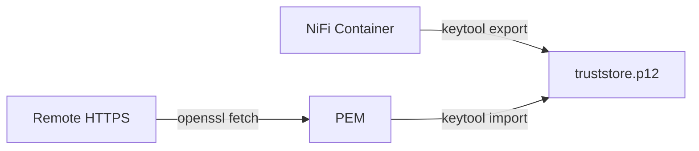

# NiFi SSL Trust Helper (Container Script)

This script assists with trusting HTTPS endpoints from inside the NiFi container by importing server certificates into the NiFi truststore. It covers two common cases:

- Local NiFi self-call (e.g., InvokeHTTP to https://$(hostname):8443)
- External HTTPS service (e.g., https://api.example.com)

## Script
- Path: `automation/scripts/nifi_trust_helper.sh`
- Run it inside the NiFi container so it can read `nifi.properties` and modify the truststore directly.

## Usage
```bash
# 1) Trust this NiFi’s own HTTPS certificate (fetched over HTTPS)
automation/scripts/nifi_trust_helper.sh local --host $(hostname) --port 8443 --alias local-nifi

# 2) Trust an external service certificate
automation/scripts/nifi_trust_helper.sh remote --url https://api.example.com:443 --alias api-example

# Options (override defaults detected from nifi.properties)
  --truststore /opt/nifi/nifi-current/conf/truststore.p12 \
  --truststore-pass <pass> \
  --truststore-type PKCS12|JKS|BCFKS
```

Notes
- The script backs up the truststore alongside the file (e.g., `truststore.p12.bak-YYYYmmddHHMMSS`).
- After changing a truststore used by a `StandardSSLContextService`, disable/enable that service in NiFi (or restart) so it reloads the truststore.
- The script prefers `openssl` for remote fetch but falls back to `keytool -printcert -sslserver` if `openssl` is not present.

## Why this exists
- InvokeHTTP and other clients require a truststore that trusts the target’s certificate. For local self-calls and many dev/test services, the certificates are self-signed or signed by a non-public CA. Importing those certificates into the truststore resolves TLS validation errors without disabling verification.



## Troubleshooting
- SSL Context Service stuck ENABLING
  - Check its validation errors in the UI or via CLI (`nifi-automation inspect controllers --output json`).
  - Ensure the truststore file, password, and type match the actual files in the container.
- Hostname mismatch
  - Prefer using the real hostname in URLs (e.g., `https://$(hostname):8443`) or ensure certificates contain the proper Subject Alternative Name.
